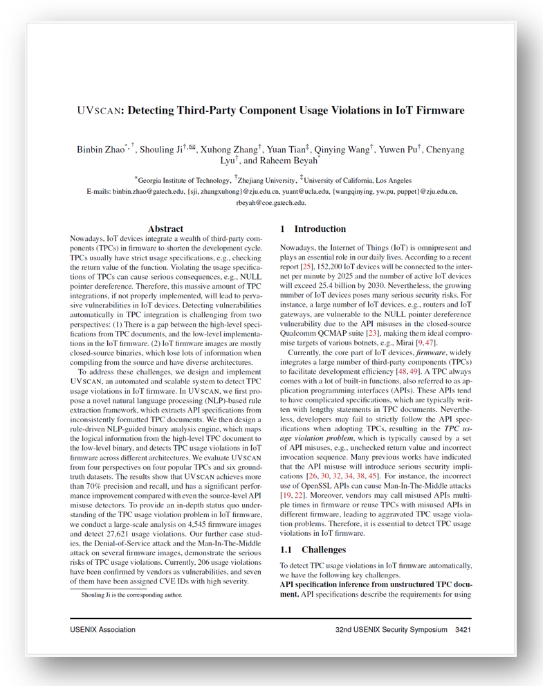

# UVScan

## Intro

Nowadays, IoT devices integrate a wealth of third-party components (TPCs) in firmware to shorten the development cycle. TPCs usually have strict usage specifications, e.g., checking the return value of the function. Violating the usage specifications of TPCs can cause serious consequences, e.g., NULL pointer dereference. Therefore, this massive amount of TPC integrations, if not properly implemented, will lead to pervasive vulnerabilities in IoT devices. Detecting vulnerabilities automatically in TPC integration is challenging from several perspectives: (1) There is a gap between the high-level specifications from TPC documents, and the low-level implementations in the IoT firmware. (2) IoT firmware is mostly the closed-source binary, which loses a lot of information when compiling from the source code and has diverse architectures.

To address these challenges, we design and implement UVScan, an automated and scalable system to detect TPC usage violations in IoT firmware. In UVScan, we first propose a novel natural language processing (NLP)-based rule extraction framework, which extracts API specifications from inconsistently formatted TPC documents. We then design a rule-driven NLP-guided binary analysis engine, which maps the logical information from the high-level TPC document to the low-level binary, and detects TPC usage violations in IoT firmware across different architectures. We evaluate UVScan from four perspectives on four popular TPCs and six ground-truth datasets. The results show that UVScan achieves more than 70% precision and recall, and has a significant performance improvement compared with even the source-level API misuse detectors. To provide an in-depth status quo understanding of the TPC usage violation problem in IoT firmware, we conduct a large-scale analysis on 4,545 firmware images and detect 27,621 usage violations. Our further case studies, the Denial-of-Service attack and the Man-In-The-Middle attack on several firmware images, demonstrate the serious risks of TPC usage violations. Currently, 206 usage violations have been confirmed by vendors as vulnerabilities, and seven of them have been assigned CVE IDs with high severity.

Further details can be found in our paper [&#34;UVSCAN: Detecting Third-Party Component Usage Violations in IoT Firmware.&#34;](https://www.usenix.org/conference/usenixsecurity23/presentation/zhao-binbin)

<p align="right">
<a href="https://www.usenix.org/system/files/usenixsecurity23-zhao-binbin.pdf">
 </p>
 </a>

## CVE Disclosure

Currently, we have been assigned the following CVE IDs.

|     CVE ID     | Severity |
| :------------: | :------: |
| CVE-2022-39828 |   High   |
| CVE-2022-39829 |   High   |
| CVE-2022-39830 |   High   |
| CVE-2022-40278 |   High   |
| CVE-2022-40279 |   High   |
| CVE-2022-40280 |   High   |
| CVE-2022-40281 |   High   |

## Citation

Please cite our work using this Bibtex entry:

```
@inproceedings{Zhao2023UVSCAN,
  author       = {Binbin Zhao and
                  Shouling Ji and
                  Xuhong Zhang and
                  Yuan Tian and
                  Qinying Wang and
                  Yuwen Pu and
                  Chenyang Lyu and
                  Raheem Beyah},
  editor       = {Joseph A. Calandrino and
                  Carmela Troncoso},
  title        = {{UVSCAN:} Detecting Third-Party Component Usage Violations in IoT
                  Firmware},
  booktitle    = {32nd {USENIX} Security Symposium, {USENIX} Security 2023},
  pages        = {3421--3438},
  publisher    = {{USENIX} Association},
  year         = {2023},
  url          = {https://www.usenix.org/conference/usenixsecurity23/presentation/zhao-binbin},
  timestamp    = {Wed, 18 Oct 2023 16:49:03 +0200},
  biburl       = {https://dblp.org/rec/conf/uss/ZhaoJ00WPLB23.bib},
  bibsource    = {dblp computer science bibliography, https://dblp.org}
}
```
